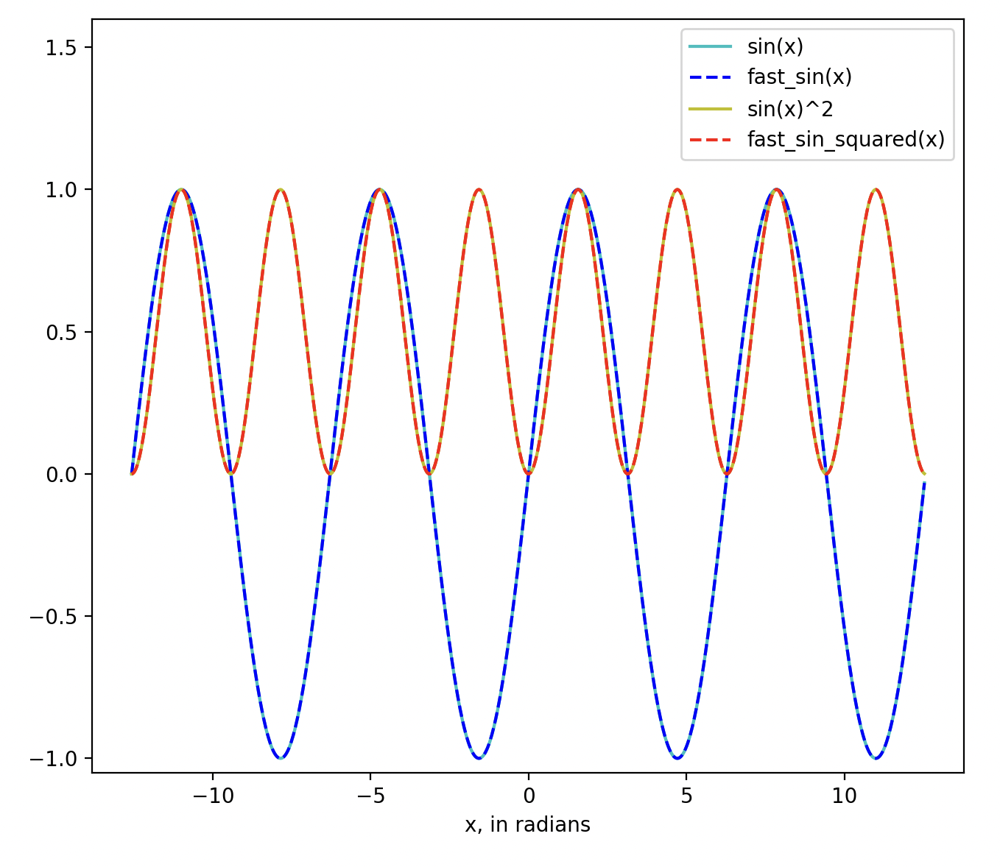
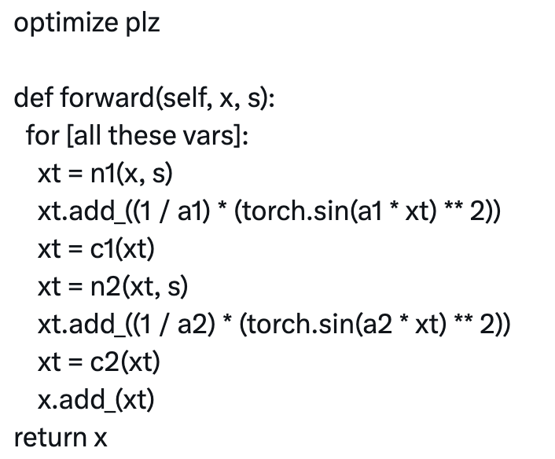

# Fast sin() via Bhaskara I

Uses [Bhaskara I](https://en.wikipedia.org/wiki/Bh%C4%81skara_I%27s_sine_approximation_formula).

Code is in [run_fast_sin_squared.py](run_fast_sin_squared.py).

Initial motivation was [this tweet](https://twitter.com/wagieeacc/status/1737209767863439402?s=51&t=bqvoQxSwV24RgugtHZZhKw):

